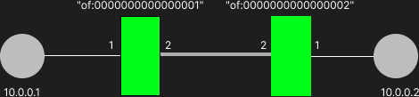

# Manualne tworzenie przepływów między dwoma hostami

## Cel



Za cel zakładamy ustawienie przepływów w ten sposób aby mozliwe bylo połączenie hosta 10.0.0.1 z 10.0.0.2 

## Rozwiązanie


### Konfiguracja switcha of:0000000000000001
- Przepływ dla strumienia wychodzącego od hosta 10.0.0.1

flow1s.json
```json
{
    "priority": 40000,
    "timeout": 0,
    "isPermanent": true,
    "deviceId": "of:0000000000000001",
    "treatment": {
      "instructions": [
        {
          "type": "OUTPUT",
          "port": "2"
        }
      ]
    },
    "selector": {
      "criteria": [
        {
          "type": "IN_PORT",
          "port": "1"
        },
        {
          "type": "ETH_TYPE",
          "ethType": "0x0800"
        },
        {
          "type": "IPV4_DST",
          "ip": "10.0.0.2/32"
        }
      ]
    }
  }
```

- Przepływ dla strumienia przychodzącego do hosta 10.0.0.1
flow1r.json
```json
{
    "priority": 40000,
    "timeout": 0,
    "isPermanent": true,
    "deviceId": "of:0000000000000001",
    "treatment": {
      "instructions": [
        {
          "type": "OUTPUT",
          "port": "1"
        }
      ]
    },
    "selector": {
      "criteria": [
        {
          "type": "IN_PORT",
          "port": "2"
        },
        {
          "type": "ETH_TYPE",
          "ethType": "0x0800"
        },
        {
          "type": "IPV4_DST",
          "ip": "10.0.0.1/32"
        }
      ]
    }
  }
```

W terminalu nalezy wywołać następujące komendy
```bash
curl --user onos:rocks -X POST "http://mininet:8181/onos/v1/flows/of:0000000000000001" -d @flow1s.json -H "Content-Type: application/json" -H "Accept: application/json"
curl --user onos:rocks -X POST "http://mininet:8181/onos/v1/flows/of:0000000000000001" -d @flow1r.json -H "Content-Type: application/json" -H "Accept: application/json"
```

### Konfiguracja switcha of:0000000000000002

- Przepływ dla strumienia wychodzącego od hosta 10.0.0.2

flow2s.json
```json
{
    "priority": 40000,
    "timeout": 0,
    "isPermanent": true,
    "deviceId": "of:0000000000000002",
    "treatment": {
      "instructions": [
        {
          "type": "OUTPUT",
          "port": "2"
        }
      ]
    },
    "selector": {
      "criteria": [
        {
          "type": "IN_PORT",
          "port": "1"
        },
        {
          "type": "ETH_TYPE",
          "ethType": "0x0800"
        },
        {
          "type": "IPV4_DST",
          "ip": "10.0.0.1/32"
        }
      ]
    }
  }
```

- Przepływ dla strumienia przychodzącego do hosta 10.0.0.2

flow2r.json
```json
{
    "priority": 40000,
    "timeout": 0,
    "isPermanent": true,
    "deviceId": "of:0000000000000002",
    "treatment": {
      "instructions": [
        {
          "type": "OUTPUT",
          "port": "1"
        }
      ]
    },
    "selector": {
      "criteria": [
        {
          "type": "IN_PORT",
          "port": "2"
        },
        {
          "type": "ETH_TYPE",
          "ethType": "0x0800"
        },
        {
          "type": "IPV4_DST",
          "ip": "10.0.0.2/32"
        }
      ]
    }
  }
```

W terminalu nalezy wywołać następujące komendy
```bash
curl --user onos:rocks -X POST "http://mininet:8181/onos/v1/flows/of:0000000000000002" -d @flow2s.json -H "Content-Type: application/json" -H "Accept: application/json"
curl --user onos:rocks -X POST "http://mininet:8181/onos/v1/flows/of:0000000000000002" -d @flow2r.json -H "Content-Type: application/json" -H "Accept: application/json"
```